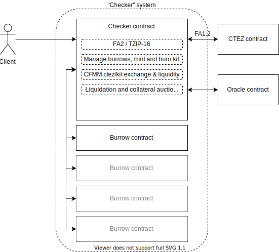

Introduction
############

.. figure:: https://i.imgur.com/3VmpA2q.jpg
   :alt: a kit

What is Checker?
================

**Checker** is a generic piece of software for creating *robocoins* on
the `Tezos blockchain <https://tezos.com/>`_. It is an open source project
supported by `Nomadic Labs <https://nomadic-labs.com/>`_,
`Tweag <https://tweag.io/>`_ and TZ Connect Berlin.

A *robocoin* is a cryptographic token (or "coin") that tracks
an external measure of value, by using various feedback mechanisms to
algorithmically control its supply. There is no widely accepted
definition of the term, which has been created for the purpose of this
document.

While it may have some similarities, Checker's robocoin mechanism
differs from the design of other coin systems which aim to track an
external value (such as a currency). Coin designs such as those of the
`JPM
<https://www.jpmorgan.com/solutions/cib/news/digital-coin-payments>`_
and Facebook's `Libra
<https://www.theguardian.com/technology/2019/jun/18/what-is-libra-facebook-new-cryptocurrency)>`_
relied on regulation by a central authority or administrator, which
Checker does not require. The Dai stablecoin managed by the `MakerDAO
project <https://makerdao.com/en/>`_ decentralizes its governance,
using voting to manage the financial risks of Dai and to ensure its
stability: Checker does not require governance by decentralized voting
either.

The Checker system eliminates governance by automating the regulation
of the robocoin's value. Specifically, Checker algorithmically
controls the coin's supply by creating incentives for creation and
destruction, in order to maintain a smoothed drift of the value of
the coin towards that of its external target measure.

Any number of Checker deployments can exist on a Tezos chain, each
managing a separate robocoin which tracks a different external measure
of value.

System overview of a Checker deployment
=======================================

At its core, Checker is a single smart contract which is tied at build time
to the following external contracts:

1. An oracle contract that will be periodically queried for the value
   of its external target measure.

2. An FA2 token contract which is used as collateral within Checker. Users
   transfer these tokens to Checker when creating burrows or depositing
   collateral and receive tokens when making withdrawals from their burrows.

3. An FA2 token contract which is used in Checker's CFMM.

4. The new `ctez <https://github.com/tezos-checker/ctez>`_ system,
   which provides the ``ctez`` token: this token has a value which tracks that
   of Tez itself, but without affording the holder any baking rights. ``ctez``
   is used in Checker's CFMM for instances of Checker configured to use ``tez``
   collateral.

A Checker deployment enables its users to mint and burn its robocoin: Checker
manages peripheral "burrow" contracts on those users' behalf, and places their
collateral deposits there.

For users who wish to exchange the robocoin with other commodities, or who wish
to provide liquidity for such exchanges, the deployment includes a CFMM
(Constant Function Market Maker) facility. This allows an exchange between the
robocoin and a single other FA2 token which can be configured at build time.

Finally, the deployment allows for liquidation of collateral tokens against
which depositors have minted robocoins, to manage when relative prices changes
render the collateral insufficient. A batched auction mechanism facilitates this
liquidation.

The deployment adjusts the terms for minting, burning and collateralising its
robocoin algorithmically based on its current market price and the target oracle
feed, such that the price drifts towards the target.

An FA2 interface is provided for each deployment's robocoin.

Configuring and building Checker for different use-cases
========================================================

Checker uses a configuration file, ``checker.yaml``, for building the contract for
different use-cases ``TODO: Add reference to a config file doc section``. While
some configurations such as system constants do not cause structural differences
in the Checker contract, other configurations such as the collateral type
require slight structural variations.

Checker currently supports the following variations:

1. Collateral type

   a. ``collateral_type=fa2`` - In this case, the collateral type is an existing
      FA2 token and the CFMM is configured to use the same FA2 token.

   b. ``collateral_type=tez`` - A special case of (1). In this case Checker's CFMM is
      required to use `ctez` and the FA2 collateral contract must use the `wtez` FA2
      wrapper for `tez` which is included in the Checker repository.

2. Drift derivative curve type

   a. ``curve_type=bang-bang`` - In this case, the drift derivative implementation
      uses a "bang-bang" curve which is discontinuous.

   b. ``curve_type=continuous`` - In this case, the drift derivative implementation uses a continuous curve.

3. ``TODO: Oracle type (index vs. token-based)``
